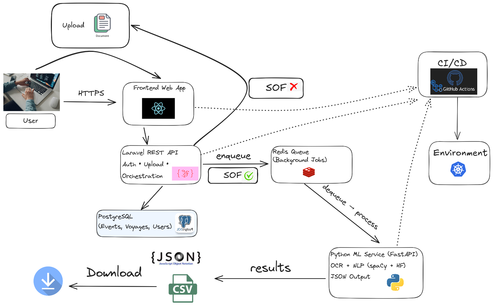

#  SoF Event Extractor & Laytime Calculator for Maritime Industry

This project automates extraction of port operation events from Statement of Facts (SoF) documents and calculates laytime, demurrage, and dispatch charges. It supports PDF and Word formats, with OCR fallback for scanned docs.

## Table of content 

### Architecture 



### Demo Video


### Features 

1. Multi-Currency Support
2. SoF Document Detection (Pre-Parsing Validation)
3. Export Results : JSON/CSV
4. Laytime, Demurrage, Dispatch Calculation
5. Document Parsing Support for Multiple Formats : PDFs/Docx


### Tech Stack 

- **Frontend:** React.js, HTTPS  
- **Backend:** Laravel (PHP) REST API, Redis Queue  
- **Database:** PostgreSQL (Events, Voyages, Users, Metadata)  
- **Machine Learning Service:** Python (FastAPI), OCR, NLP (spaCy + HuggingFace), JSON/CSV output  
- **Infrastructure:** Kubernetes, GitHub Actions (CI/CD)

## Setup Instructions

This explains how to set up the system on both **Windows** and **Linux**.  
The stack includes: **React (Frontend)**, **Laravel (API)**, **PostgreSQL**, **Redis**, **Python FastAPI ML Service**, all running on **Kubernetes** with **GitHub Actions CI/CD**.

---

### 1. Prerequisites

#### Windows
- [Docker Desktop (with Kubernetes enabled)](https://www.docker.com/products/docker-desktop)  
- [kubectl](https://kubernetes.io/docs/tasks/tools/install-kubectl-windows/)  
- [Helm](https://helm.sh/docs/intro/install/)  
- [Node.js + npm](https://nodejs.org/en/download/)  
- [PHP](https://windows.php.net/download/) + [Composer](https://getcomposer.org/download/)  
- [Python 3.9+](https://www.python.org/downloads/windows/) + pip  
- [Git](https://git-scm.com/download/win)  

#### Linux (Ubuntu/Debian)
```bash
# Kubernetes tools
sudo apt update
sudo apt install -y curl git build-essential

# kubectl
curl -LO "https://dl.k8s.io/release/$(curl -s https://dl.k8s.io/release/stable.txt)/bin/linux/amd64/kubectl"
sudo install -o root -g root -m 0755 kubectl /usr/local/bin/kubectl

# Minikube (optional for local)
curl -LO https://storage.googleapis.com/minikube/releases/latest/minikube-linux-amd64
sudo install minikube-linux-amd64 /usr/local/bin/minikube

# Helm
curl https://raw.githubusercontent.com/helm/helm/main/scripts/get-helm-3 | bash

# Node.js
curl -fsSL https://deb.nodesource.com/setup_18.x | sudo -E bash -
sudo apt install -y nodejs

# PHP + Composer
sudo apt install -y php-cli unzip php-mbstring php-bcmath
curl -sS https://getcomposer.org/installer | php
sudo mv composer.phar /usr/local/bin/composer

# Python
sudo apt install -y python3 python3-pip
```

---

### 2. Clone Repository
```bash
git clone git@github.com:DeeBi9/layspan.git
cd layspan
```

---

### 3. Frontend Setup (React)
```bash
cd frontend
npm install
npm run build
```
- On **Windows**: Ensure PowerShell has permission for scripts (`Set-ExecutionPolicy RemoteSigned`).  
- The build output (`/build`) will later be served in Kubernetes (e.g., with **Nginx container**).  

---

### 4. Backend Setup (Laravel REST API)
```bash
cd backend
composer install
cp .env.example .env
php artisan key:generate
```

- Update `.env` with:
  - PostgreSQL host, username, password  
  - Redis host, port  
  - Queue driver = `redis`  

Run migrations:
```bash
php artisan migrate
```

On **Windows**, use:
```powershell
php artisan serve
```

On **Linux**, use:
```bash
php artisan serve --host=0.0.0.0 --port=8000
```

---

### 5. PostgreSQL Setup
Deploy PostgreSQL in Kubernetes:
```bash
helm repo add bitnami https://charts.bitnami.com/bitnami
helm install postgres bitnami/postgresql
```
- Grab credentials:
```bash
kubectl get secret --namespace default postgres-postgresql -o jsonpath="{.data.postgres-password}" | base64 -d
```
- Update Laravel `.env` with these values.

---

### 6. Redis Queue Setup
Deploy Redis in Kubernetes:
```bash
helm install redis bitnami/redis
```
- Update `.env` in Laravel with Redis connection info.

---

### 7. Python ML Service (FastAPI)
```bash
cd ml-service
pip install -r requirements.txt
```

Run locally for testing:
```bash
uvicorn app:app --host 0.0.0.0 --port=8000
```

Deploy in Kubernetes using a Deployment + Service YAML.  

---

### 8. Kubernetes Deployment
- Create Kubernetes manifests (`/k8s/`) for:
  - Frontend (React build with Nginx)  
  - Backend (Laravel API + worker)  
  - PostgreSQL  
  - Redis  
  - Python ML Service (FastAPI)  

Apply them:
```bash
kubectl apply -f k8s/
```

---

### 9. CI/CD (GitHub Actions → Kubernetes)
- Code pushed to GitHub → GitHub Actions builds Docker images and pushes to registry.  
- GitHub Actions then deploys updated services to Kubernetes via `kubectl` or `helm upgrade`.  

---

### 10. Access the App
- **Ingress / LoadBalancer** service exposes the frontend.  
- Users upload documents → API → Redis Queue → Python ML Service → PostgreSQL → Results downloadable (JSON/CSV).  

## Team

1. Deepanshu Bisht (Leader) : https://github.com/DeeBi9
2. Priya Sharma : https://github.com/pri12ya871
3. Mohit Bisht : https://github.com/Mohiit70

## License

This project is licensed under the [MIT License](./LICENSE.md).